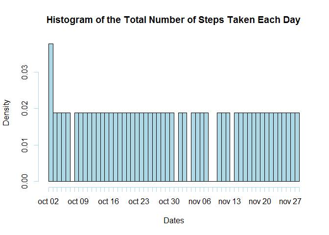
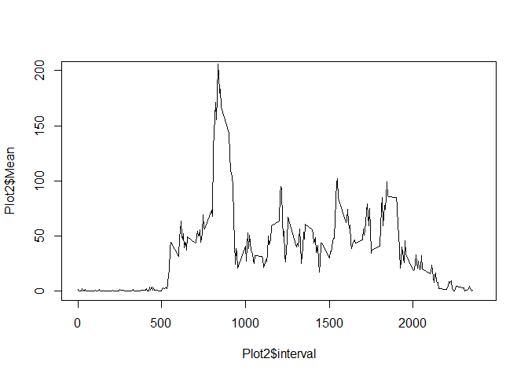
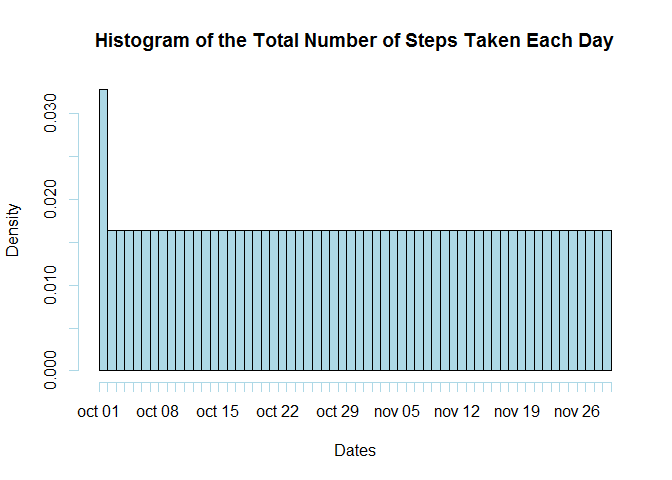
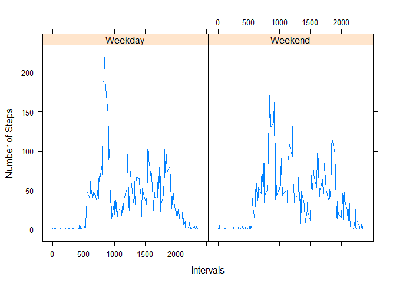

# Assigment 1
Osiris Sanchez  
Thursday, February 12, 2015  

###Loading and Preprocessing the data

Here is the code for Load the Data, process and transformations are included 


```r
##Load the file
data<-read.csv("C:/Users/Usuario/Downloads/activity.csv")
##Converting to date
data$date<-as.Date(data$date)
```

###What is mean total number of syteps taken per day?

####Question 1


```r
##Getting out NA from data
CleanData<-data[complete.cases(data),]
##Total Number Steps
TotalSteps<-sum(CleanData$steps)
```

The number of steps taken by day are: 570608


####Question2
 here is the code of te Histogram of the total number of steps taken each day

```r
##Histogram chart
hist(CleanData$date,"days", col="lightblue",xlab="Dates",
 main="Histogram of the Total Number of Steps Taken Each Day")
```

 

####Question3

```r
mean<-mean(CleanData$steps)
median<-median(CleanData$steps)
```
The mean  of the total number of steps taken by day are: 37.3825996
The mean  of the total number of steps taken by day are: 0

###What is the average daily activity pattern?

####Question1
Here is the code and plot for the time series plot  of the 5-minute interval


```r
Plot2<-aggregate(CleanData$steps, by=list(CleanData$interval), FUN=mean)
colnames(Plot2)<-c("interval","Mean") 

plot(Plot2$interval,Plot2$Mean,xlim=c(0,2400),ylim=c(0,200),type="l")
```

 

####Question2
this is the code to get the 5-minute interval with the maximum avergae of number of steps 


```r
Maximum<-max(Plot2$Mean)
MaximunInterval<-subset(Plot2,Mean== Maximum)
MaxInterval<-MaximunInterval$interval
```

The Interval  835 has the Maximum average of number of steps

###Imputing missing values

####Question1

Calculate and report the total number of missing values


```r
NAData<-data[is.na(data$steps),]
RowsNA<-nrow(NAData)
```

There are 2304 rows with NA

####Question2

Code for filling up the NA


```r
## filling the NA with the value of the mean of every interval
NAData <- merge(NAData,Plot2,by="interval")
NAData$steps<-NAData$Mean
NAData$Mean<- NULL
```


####Question3
New data set but with the missing data filled


```r
##Data without NA is in CleanData Loaded
##Data With NA is in NAData 

CombinedData <- rbind(NAData,CleanData)
```

####Question4
Histogram of the total number of steps taken each day 
 code and plot 
 

```r
hist(CombinedData $date,"days", col="lightblue",xlab="Dates",
 main="Histogram of the Total Number of Steps Taken Each Day")
```

 

code for the mean and median


```r
meanComb<-mean(CombinedData$steps)
medianComb<-median(CombinedData$steps)
```
The mean  of the total number of steps taken by day are: 37.3825996
The mean  of the total number of steps taken by day are: 0


Comparing to the previous values the mean and median do not differ, There is no impact in adding the mean and median of the intervals to the NA values.


###Are there diferrences in activity patterns between WeekDays and Weekends

####Question 1
Create a new factor in the Data set with two levels indicating whether a given date is weekday or weekend

here is the code:


```r
##Creating the days column
CombinedData$Weekdays<-weekdays(CombinedData$date) 
##Clasificacion of the days in number 0-6 starting on Sunday 
CombinedData$NumberDay<-as.POSIXlt(CombinedData$date)$wday
## if for clasificacion of weekend and weekdays
CombinedData$IsWeekend <- ifelse(CombinedData$NumberDay <= 1, "Weekend", "Weekday")
```

###Question 2
Make a plot containg a time series plt of the 5 minute interval and the average numbers of steps taken, averaged across all weekday days or weekend days


```r
##Grouping the Data by interval and Is weekend
Graph<-aggregate(CombinedData$steps, by=list(CombinedData$interval,CombinedData$IsWeekend), FUN=mean)

colnames(Graph)<-c("interval","IsWeekend","steps" )
#Plot Making
library(lattice)
xyplot(Graph$steps ~ Graph$interval | Graph$IsWeekend , xlab="Intervals",
ylab="Number of Steps",type = "l",as.table=FALSE
)
```

 


